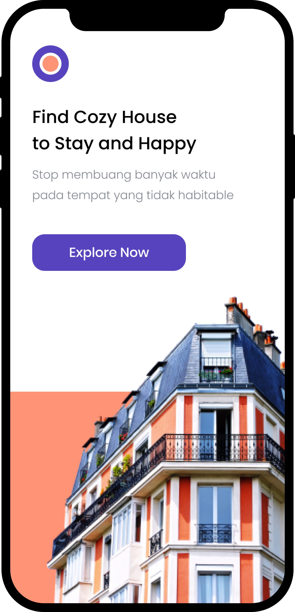
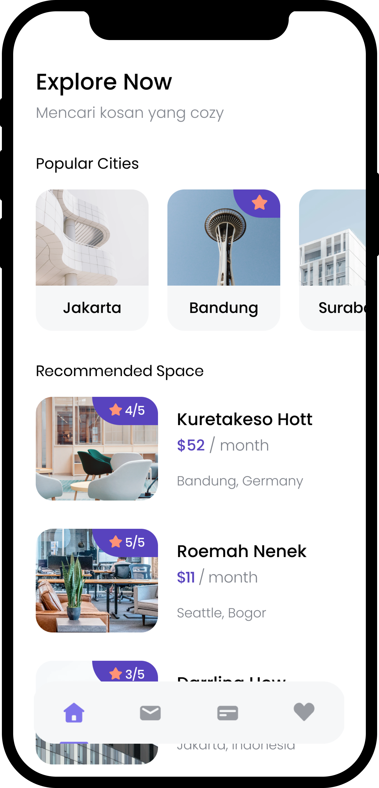
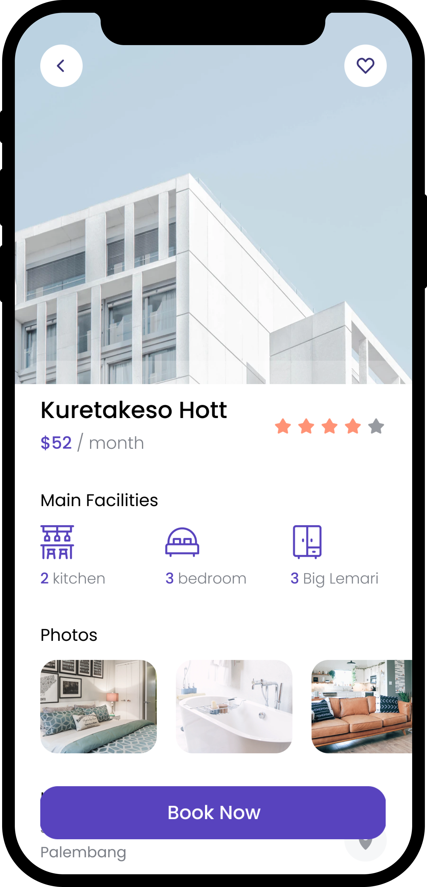
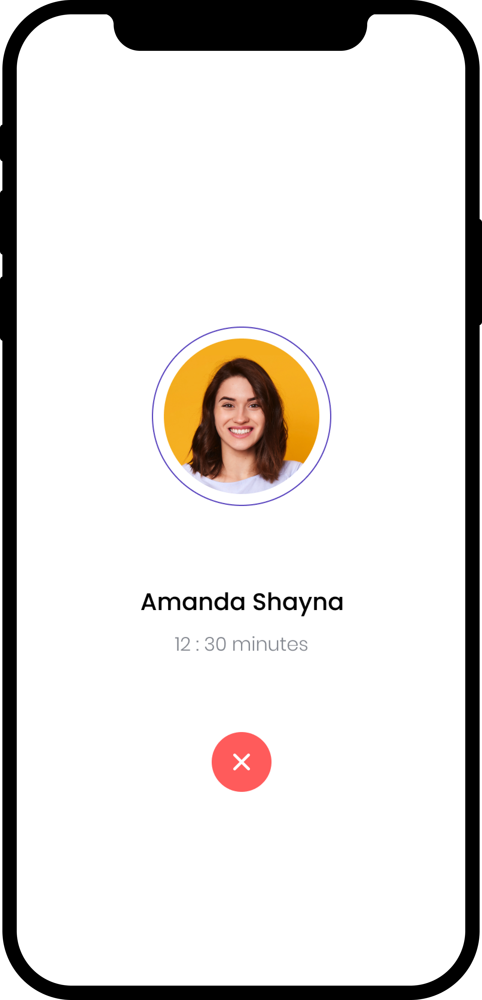
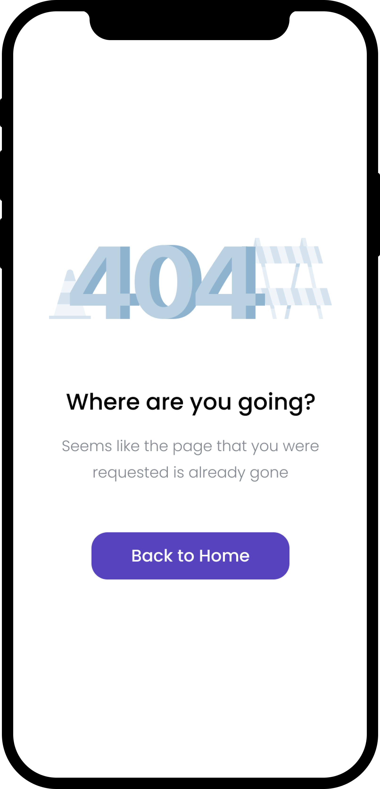
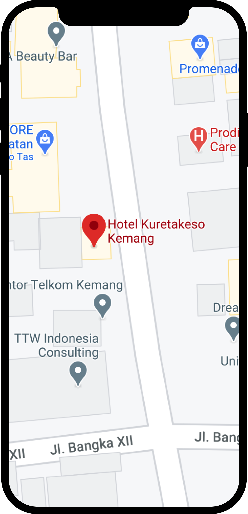

# cozy

A new Cozy App Flutter project.

design view Code by bwa.

## Getting Started

This project is a starting point for a Flutter application. I Just implement that include in bwa course video on they website for my practice.

Big Thank's to bwa who make a video and course that i use for my practice.

## Development Setup

Clone the repository and run the following commands:
```
flutter pub get
flutter run
```

## Screenshot

Here is some UI View.

               
